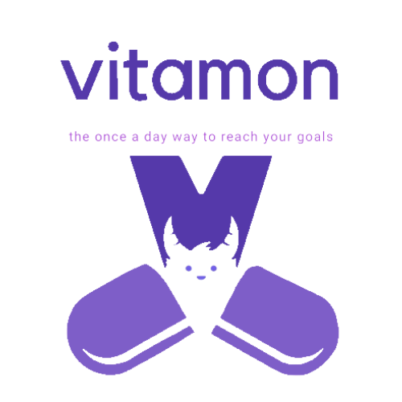

Adopt monsters that are fed by your healthy habits.

---

## Table of contents

- [Introduction](#introduction)
- [Setup](#setup)
- [Technologies](#technologies)
- [Features](#features)
- [Development_Team](#development_team)

---

## Introduction

 Vitamon is a fun mobile application that allows users to set and achieve goals through a routine and reward system. In our app, Vitamons are monsters that are fed through users’ healthy habits and daily accomplishments. You can also add friends to help keep you accountable. Flex your achievements on the Vitamon app! 

---

## Setup
For iOS or Android users:

1. On your device, download expo go from the app store
2. Sign in to expo with the following credentials:

    • Username: vitamonapp@gmail.com
    
    • Password: vitamon

3. On the profile page under published projects, click on Vitamon
4. Sign up for an Vitamon account or log in. You now have access to Vitamon!

Note: Android users must manually update their progress for Steps Vitamon and are not currently able to play QuickGoals

---

## Technologies

- JavaScript - version: 12.11.1
- React - version: 16.13.1
- React-Native - version: 40.0.1
- Redux - version: 4.0.5
- Node.js - version:12.11.1
- Expo - version : ~40.0.0
- Victory-native - version: ^35.3.1
- Lottie-React-Native - version: ^2.6.1
- Express - version: ^4.16.4
- Passport - version: ^0.4.0
- Sequelize - version: ^5.3.1,

Link to [backend](https://github.com/Vitamon-App/Vitamon-backend "Vitamon Backend Repository")
---

## Features

- Adopt monsters that represent your goals.
- Track your water intake with our Water Vitamon.
- Use your phone's pedometer to track your steps with our Steps Vitamon.
- Find users in our database and add them as friends.
- View your past goals represented as graphs.

Upcoming Features:
- Push notifications that remind you to login.
- Dynamic realtime leaderboard.

---

## Development_Team
 
[Melissa Pastore](https://www.linkedin.com/in/melissalpastore) | [Veronica Tomchak](https://www.linkedin.com/in/veronica-tomchak) | [Priscila Pintado](http://www.linkedin.com/in/priscila-pintado") | [Daniel Park](https://www.linkedin.com/in/danieljosephpark)
